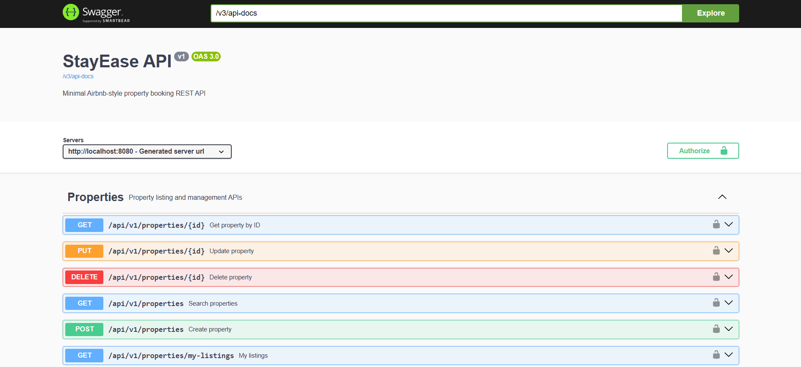
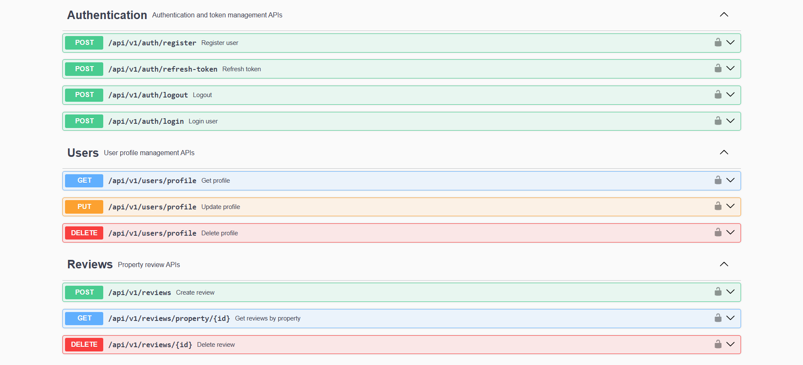
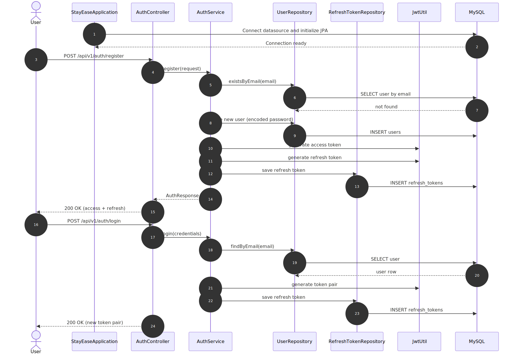
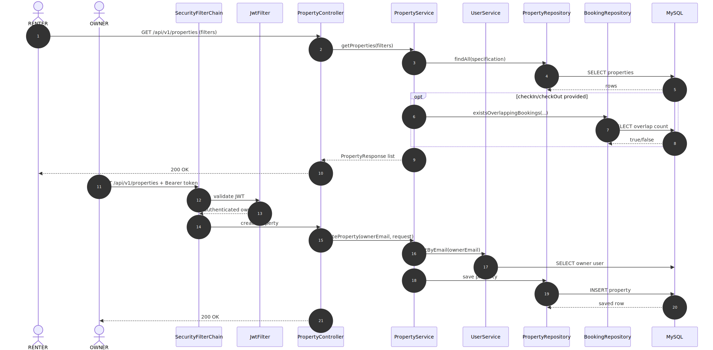
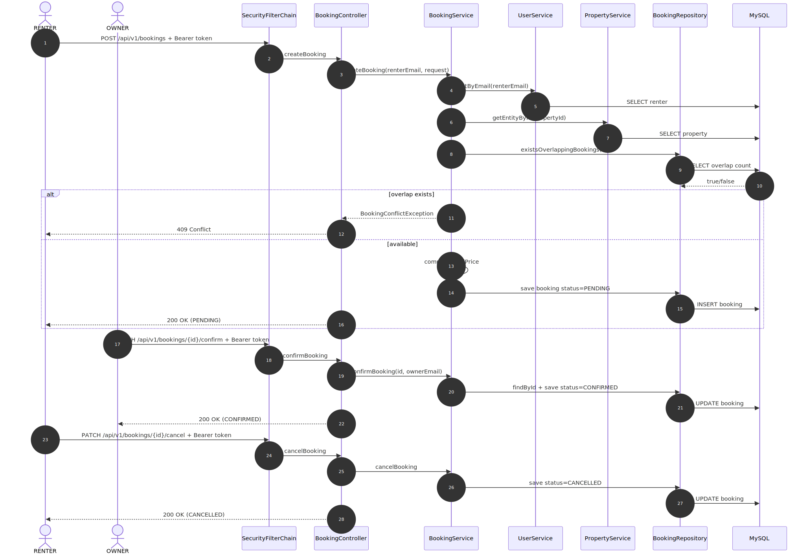
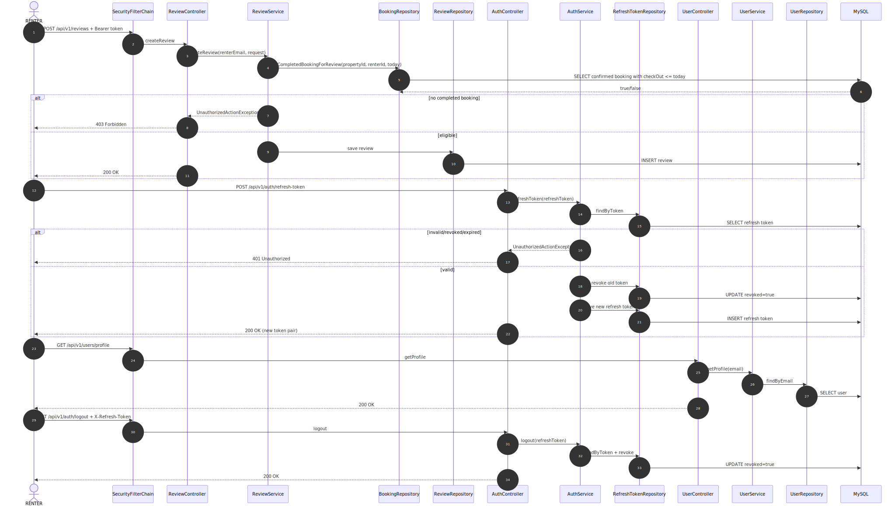

# StayEase

StayEase is a minimal Airbnb-style property booking REST API built with Java 17 and Spring Boot 3.

It supports:
- JWT authentication (access token + refresh token)
- Role-based authorization (OWNER, RENTER)
- Property listing management
- Booking lifecycle with overlap checks
- Review restrictions based on completed stays
- OpenAPI/Swagger documentation

## API Documentation

**Access at:** https://stayease-w3h3.onrender.com/swagger-ui/index.html

### Swagger UI Screenshots





## Tech Stack

- Java 17
- Spring Boot 3.3.5
- Spring Security 6 + JWT
- Spring Data JPA + Hibernate
- MySQL 8
- Springdoc OpenAPI 2.6.0
- Maven

## Project Structure

```text
src/main/java/com/fahad/stayease
├── auth
│   ├── controller
│   ├── dto
│   ├── model
│   ├── repository
│   └── service
├── booking
│   ├── controller
│   ├── dto
│   ├── model
│   ├── repository
│   └── service
├── config
├── exception
├── property
│   ├── controller
│   ├── dto
│   ├── model
│   ├── repository
│   └── service
├── review
│   ├── controller
│   ├── dto
│   ├── model
│   ├── repository
│   └── service
└── user
    ├── controller
    ├── dto
    ├── model
    ├── repository
    └── service
```

## Sequence Phases

**Phase 1: User Registration & Authentication**


**Phase 2: Property Listing & Management**


**Phase 3: Booking & Reservation**


**Phase 4: Review & Feedback**


## Business Rules Implemented

- Only OWNER can create/update/delete properties
- Only RENTER can create bookings
- Booking overlap check prevents date conflicts (`409 CONFLICT`)
- Booking total price is computed at booking time
- Only RENTER with completed stay can create reviews
- OWNER can confirm bookings
- Both OWNER and RENTER can cancel bookings

## Requirements

- JDK 17+
- Maven 3.9+
- MySQL (local or cloud)

## Configuration

Application configuration is in `src/main/resources/application.yml` and is environment-variable friendly.

### Environment Variables

| Variable | Default | Description |
|---|---|---|
| `PORT` | `8080` | App HTTP port |
| `SPRING_DATASOURCE_URL` | `jdbc:mysql://localhost:3306/stayease?createDatabaseIfNotExist=true&sslMode=DISABLED&serverTimezone=UTC` | JDBC URL |
| `SPRING_DATASOURCE_USERNAME` | `root` | DB username |
| `SPRING_DATASOURCE_PASSWORD` | `root` | DB password |
| `SPRING_DATASOURCE_DRIVER_CLASS_NAME` | `com.mysql.cj.jdbc.Driver` | JDBC driver |
| `JWT_SECRET` | fallback value in config | JWT signing secret |

## Run Locally

```bash
mvn clean compile
mvn spring-boot:run
```

On successful startup, console prints:

- Swagger UI: `http://localhost:8080/swagger-ui.html`
- OpenAPI JSON: `http://localhost:8080/v3/api-docs`

## Build Jar

```bash
mvn clean package
java -jar target/stayease-0.0.1-SNAPSHOT.jar
```

## API Overview

Base path: `/api/v1`

### Auth

- `POST /auth/register` (Public)
- `POST /auth/login` (Public)
- `POST /auth/refresh-token` (Public)
- `POST /auth/logout` (Authenticated)

### Users

- `GET /users/profile` (Authenticated)
- `PUT /users/profile` (Authenticated)
- `DELETE /users/profile` (Authenticated)

### Properties

- `POST /properties` (OWNER)
- `PUT /properties/{id}` (OWNER)
- `DELETE /properties/{id}` (OWNER)
- `GET /properties` (Public)
- `GET /properties/{id}` (Public)
- `GET /properties/my-listings` (OWNER)

### Bookings

- `POST /bookings` (RENTER)
- `GET /bookings/{id}` (Authenticated: owner or renter)
- `GET /bookings/my-bookings` (RENTER)
- `GET /bookings/property/{id}` (OWNER)
- `PATCH /bookings/{id}/cancel` (Authenticated: owner or renter)
- `PATCH /bookings/{id}/confirm` (OWNER)

### Reviews

- `POST /reviews` (RENTER)
- `GET /reviews/property/{id}` (Public)
- `DELETE /reviews/{id}` (RENTER)
